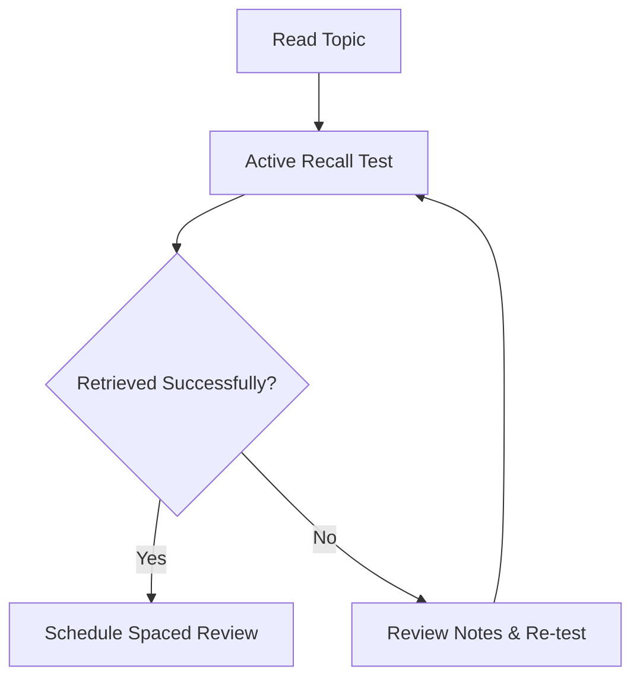

# Learning & memory

*Psychology 101 · Chapter 4 · Revision notes*

## 1. Core concepts

**Active recall** strengthens memory by retrieving information rather than simply rereading it. Combine it with **spaced repetition** for durable learning.[^1] **स्मृति (Memory)** को तीन चरणों में समझें — encoding, storage, और retrieval।

> [!TIP] Key takeaway
> Test yourself before checking your notes. A little difficulty during retrieval can improve long-term retention.
>
> - Close the notes, then recall
> - Check, correct, repeat

### The forgetting curve

A simplified model for memory retention is $R(t) = e^{-t/S}$, where $S$ represents memory strength:

$$
R(t) = e^{-\frac{t}{S}}, \qquad \lim_{t \to \infty} R(t) = 0
$$

```plot
title: Ebbinghaus Forgetting Curve & Retention
domain: [0, 10]
range: [0, 1.1]
grid: true
y = exp(-x/2), color: #dc2626, label: Without review: R(t) = e^(-t/2)
y = exp(-x/6), color: #2563eb, label: With 1st review: R(t) = e^(-t/6)
point: (0, 1), label: 100% Initial Learning
point: (2, 0.37), label: ~37% Retention at t=2
area: [0, 5], from: 0, to: exp(-x/6), fill: rgba(37, 99, 235, 0.12)
```

## 2. Compare study strategies

| Strategy | What you do | Best use |
| :--- | :--- | :--- |
| Active recall | Answer without looking | Check understanding |
| Spaced repetition | Review at increasing intervals | Long-term retention |
| Interleaving | Mix related problem types | Distinguish concepts |

## 3. Put it into practice

1. Read a short section.
2. Close the book and explain it in your own words.
   - Identify gaps in your explanation.
   - Write one question for each gap.
3. Review the questions tomorrow.



### A simple review schedule

```python
def review_days(start_day):
    # Space reviews over time
    intervals = [1, 3, 7, 14, 30]
    return [start_day + gap for gap in intervals]
```

## 4. Revision checklist

- [x] Define active recall
- [x] Compare study strategies
- [ ] Explain the forgetting curve without notes
- [ ] Complete a practice quiz

> [!WARNING] Common exam trap
> Confusing **negative reinforcement** (removing something unpleasant) with **punishment** (adding something unpleasant).

~~Reread everything.~~ **Retrieve, check, repeat.**

---

### Further reading

Visit [Learning Scientists](https://www.learningscientists.org/) for study resources. Use `review_days(0)` to plan your first month.

[^1]: These notes are an illustrative sample, not a substitute for your course readings.
